# Challenge LiterAlura

## Acerca de.

La aplicación consiste en una aplicacion de back-end utilizando el framework de **SpingBoot** para realizar una aplicacion de consola de tipo gestion de biblioteca, la aplicacion se conecta a una API (Gutendex) el cual obtiene la informacion de la API y dependiendo de la opcion del usuario este muestra dicha informacion.

El iniciar la aplicación, en esta se mostrará un menú en el cúal el usuario podra seleccionar la opción que el quiera, si selecciona la primera **buscar un libro por su titulo** no solo hara la busqueda y le proporcionara al usuario la informacion del libro sino que ademas se estara registrando la informacion en una base de datos, de cual rescatara la informacion de las siguientes opciones; las cuales son:
1. Listar los libros registrados.
2. Listar autores registrados.
3. Listar autores vivos en un determinado año
4. Listar libros por idiomas.

## Tecnologias utilizadas.
* ### Java - JDK 17
* ### SpringBoot 3.4.6
* ### PostgreSQL 17
* ### Jackson core 2.19
* ### API - Gutendex

## Extra, "application properties"
Para este caso no se incluyo en el repositorio, este archivo brindado por spring por seguiridad ya que se requiere de tus credenciales.
```
spring.datasource.url=jdbc:postgresql://localhost/YOUR_DATABASE
spring.datasource.username=YOUR_USER_DB
spring.datasource.password=YOUR_PASSWORD_DB
spring.datasource.driver-class-name=org.postgresql.Driver
spring.jpa.hibernate.ddl-auto=update
spring.jpa.show-sql=false <- Opcional, solo si quieres ver como se realizan las consultas poner en true
```

## Funcionamiento.
1. **Buscar un libro por su titulo**: Al elegir la siguiente opción lo que se le preguntará al usuario es el titulo de uno de los libros que desea buscar, si existe el libro en la API le dara la informacion del libro y ademas almacenara la informacion necesaria en la base de datos. 

2. **Listar los libros registrados**: Esta opción lo que hace es buscar en la base de datos todos los libros que tenga registrados, cabe resaltar nuevamente que son los de la base de datos y no los de la API los que muestra, ademas de mostrar la informacion solicitada en los requisitos los cuales son:

    2.1. **Datos del libro**
    * Título
    * Autor
    * Idiomas
    * Número de Descargas.

3. **Listar autores registrados**: Esta opcion es similar que la de **Listar libros registrados** la diferencia es que en vez de mostrar la informacion de los libros se mostrara la informacion de los autores en base a los requerimientos de la aplicacion, los cuales son:

    3.1. **Datos de Autor**
    * Nombre
    * Año de nacimiento
    * Año de fallecimiento.

4. **Listar autores vivos en un determinado año**: Al selecionar esta opción el usuario ingresa una determinada fecha para ver si de los autores que estan registrados alguno coincide con la fecha en la que estuvo vivo dicho autor.

5. **Listar libros por idioma**: Al seleccionar esta opción lo que se le pide al usuario es que ingrese como texto la anotacion corta de un idioma o que la escriba el idioma en español, cualquiera de las dos opciones, si existen libros registrados este le dira al usuario cuantos libros hay de dicho idioma, como extra en esa opcion, se añadio mostrar los libros de dicho idioma.

## Ejemplo.
En la siguiente imagen podemos observar como se ve la aplicación al final. 
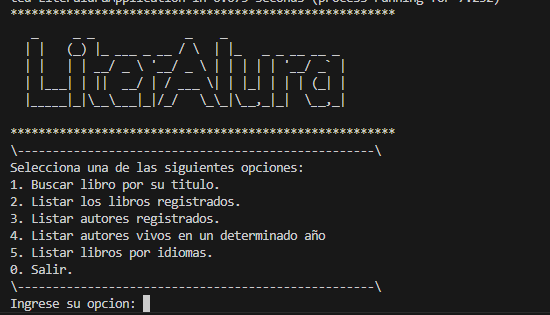

Si seleccionamos por ejemplo la primera opción se le pregunta al usuario el titulo de un libro que desea buscar.

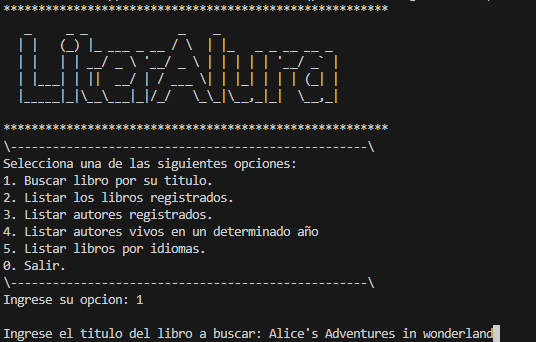

Al elegir un titulo valido, la aplicación hace una llamada a la API donde busca dicho titulo, rescata la informacion necesaria y la registra en la base de datos, por ultimo le muestra al usuario la informacion del libro.
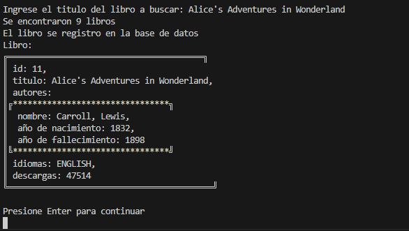

Si digamos buscamos el mismo libro la aplicacion nos informara que se libro ya se registro en la base de datos y no lo duplicara.

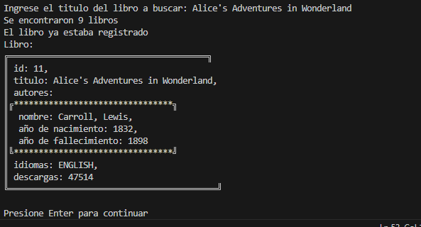

Ahora probemos a mirar la lista de los libros que estan registrados en la base de datos.
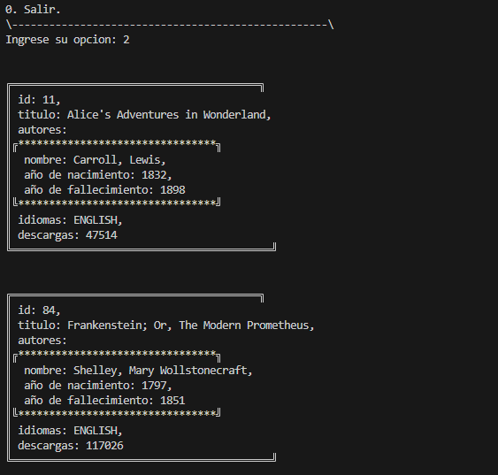

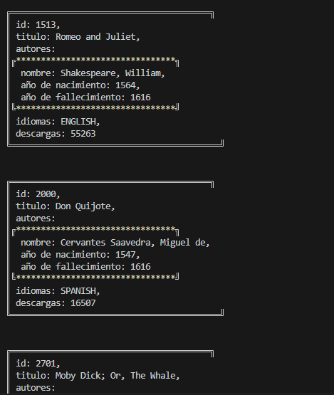

Ahora probemos a mirar la lista de los autores registrados en la base de datos.

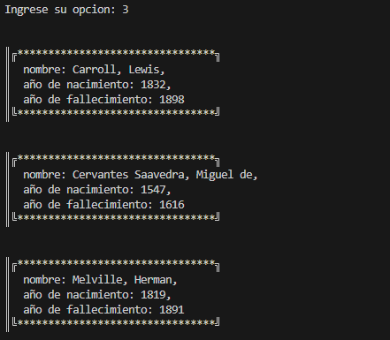

Ahora veamos los autores que estuvieron vivos en una determinada fecha.

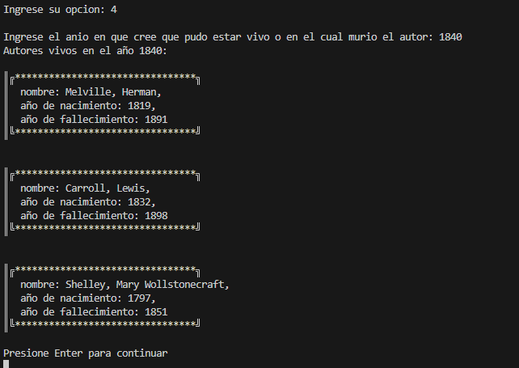

Por ultimo busquemos los libros registrados por un determinado idioma, para este caso se probaran los que ya estan registrados.

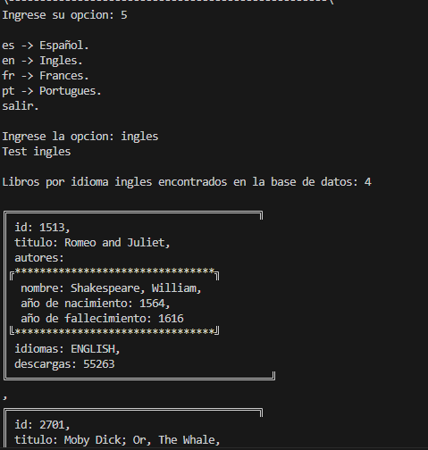

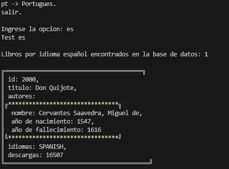

## Validaciones.

1. **Opciones invalidas en menu**: Una de las primeras validaciones es entradas no validas en los menu, tenemos 2 menus y en ambos se aseguro que las entradas recibidas fueran las que se proporcionan en pantalla.

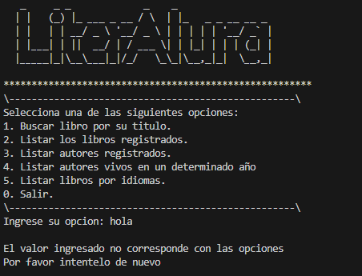

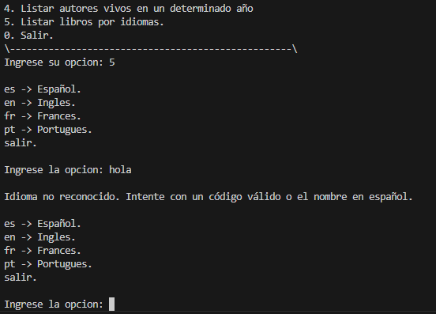

**NOTA: el unico texto permitido como opcional es la palabra "salir" en caso de no querer usar 0**

2. **Texto en busquedas mayusculas o minusculas**: Otra de las validaciones es las entradas de texto en las busquedas o idiomas, sea cual sea la entrada si es valida la app continuara.

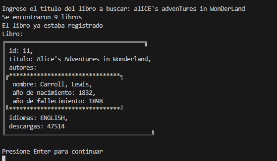

3. **Conexion a API**: Verifica la conexion de la API si por alguna razon se pierde la conexion este informara al usuario y terminara la app.

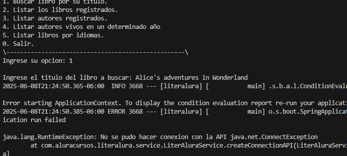

4. **Autores vivos en una determinada año**: Se aseguro que no se pongan fechas invalidas a la hora de buscar autores vivos en un determinado tiempo, como años negativos o años al año de la epoca actual.

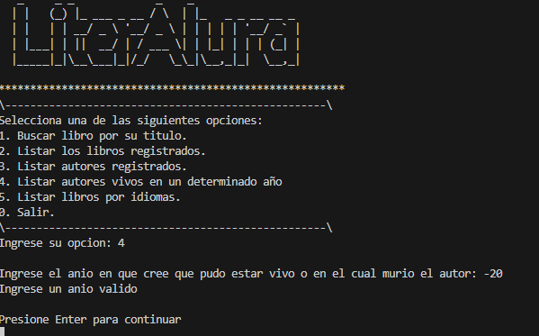

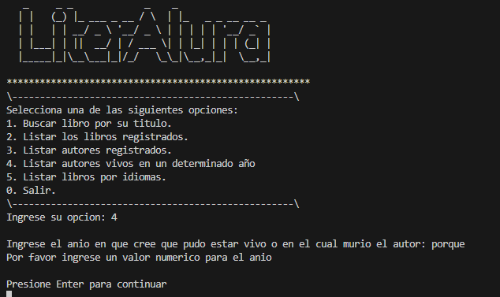

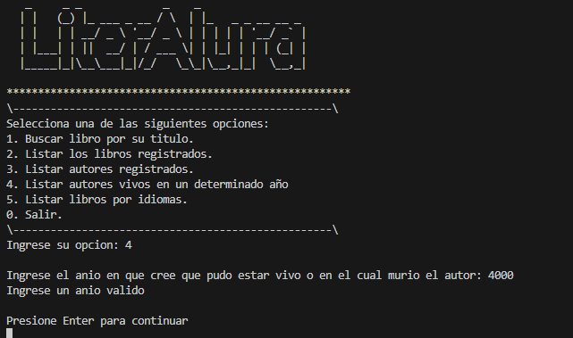